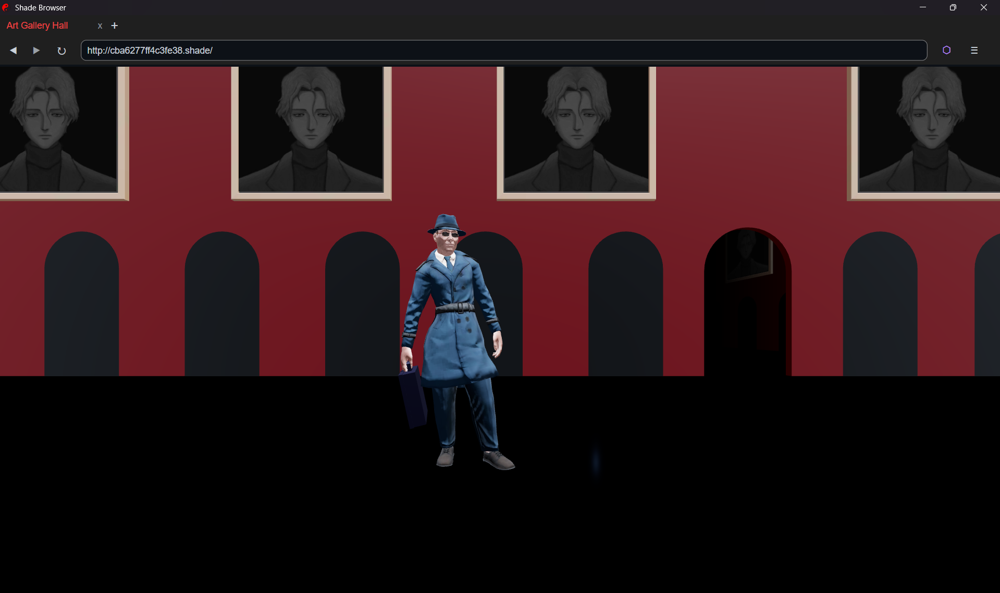
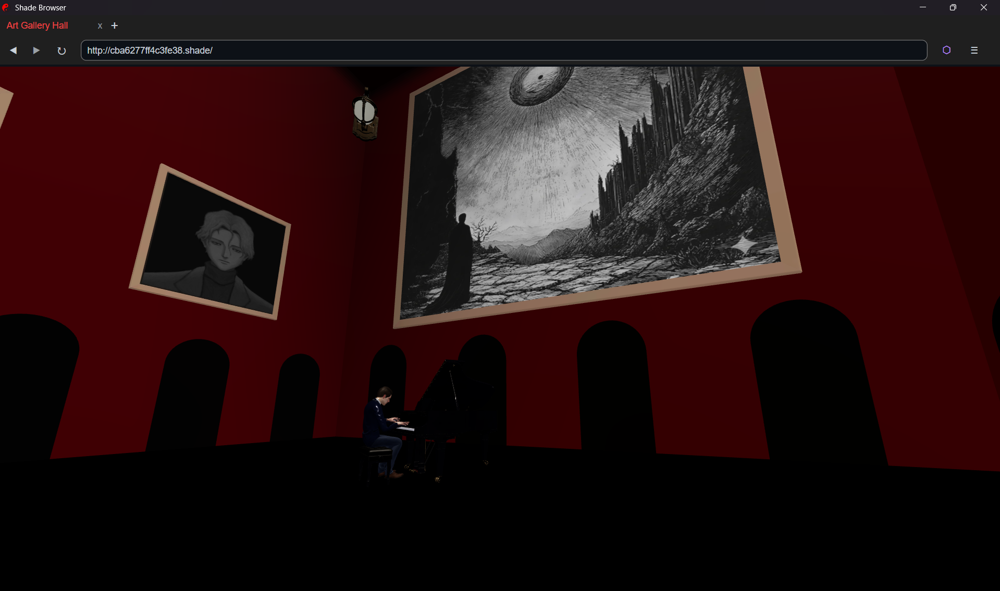
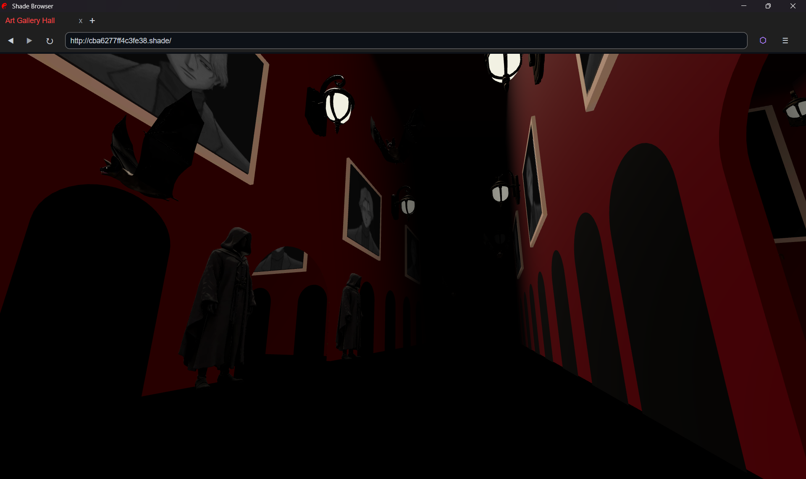
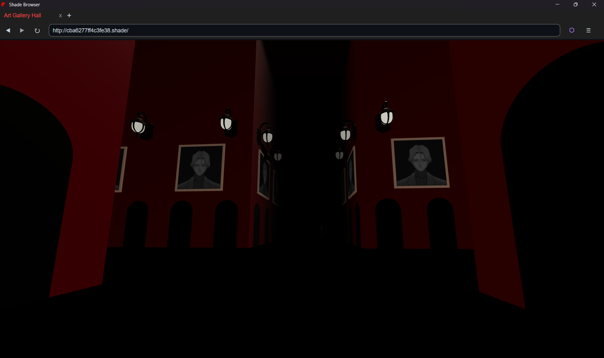
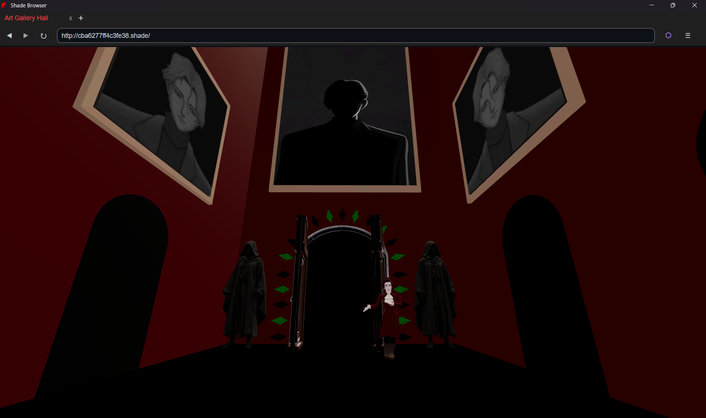
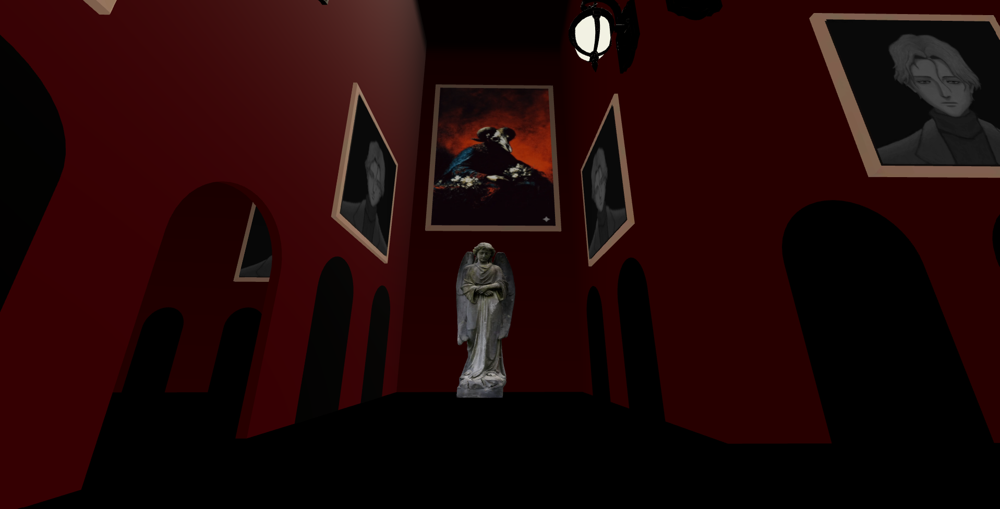
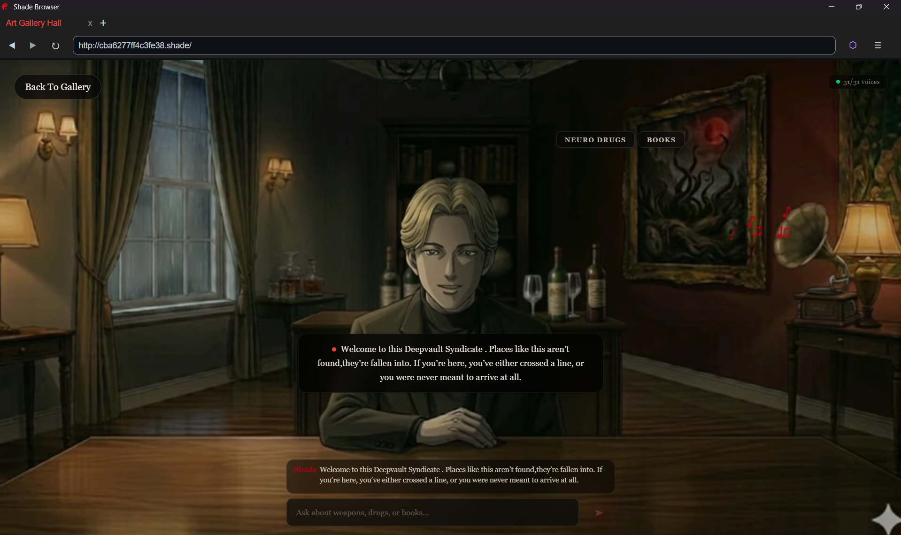
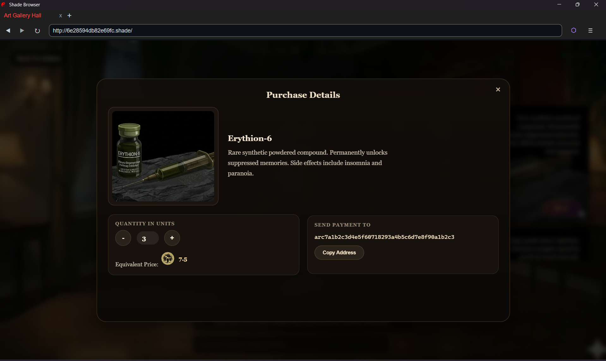

# 🕳️ Deepvault Syndicate

An immersive 3D first-person web experience simulating an underground hidden market, where users navigate a dark gallery and negotiate with an AI-powered dealer through chat.


---

## 🎮 Features

- **Fully navigable 3D environment** — First-person controls with WASD movement, arrow-key camera, wall collision, and fog-lit atmosphere built entirely in the browser
- **Spatial audio system** — 3D-positioned voices, ambient rain, lightning, and piano that react to player proximity
- **AI salesman (Johan)** — Powered by LLM; routes queries to pre-cached voiced responses or generates dynamic text replies
- **Animated NPCs** — Walking escort with dialogue subtitles, talking gatekeeper, and pianist, all triggered by proximity
- **Unified deployment** — Single FastAPI server serves both the React frontend and the API backend

---

## 🎬 Demo

[](https://youtu.be/IfKlVm9ghrk)

▶️ [Watch the full demo on YouTube](https://youtu.be/IfKlVm9ghrk)

---

## 📸 Screenshots

<table> <tr> <td width="50%">  </td> <td width="50%">  </td> </tr> <tr> <td width="50%">  </td> <td width="50%">  </td> </tr> <tr> <td width="50%">  </td> <td width="50%">  </td> </tr> <tr> <td width="50%">  </td> <td width="50%">  </td> </tr> </table>

---

## 📁 Project Structure

```
deepvault/
├── brain/                  # Python backend
│   ├── server.py           # FastAPI server (API + frontend serving)
│   ├── phrases.json        # Cached responses & product catalog
│   ├── voice_cache/        # Pre-generated voice audio (.opus)
│   ├── requirements.txt    # Python dependencies
│   ├── .env.example        # Environment variable template
│   └── .env                # Local env vars (gitignored)
├── ui/                     # React frontend
│   ├── src/
│   │   ├── App.jsx         # Root component, startup preloading
│   │   ├── ThreeScene.jsx  # 3D scene (R3F), NPCs, audio, controls
│   │   ├── Room.jsx        # Chat UI, product list, Johan overlay
│   │   ├── ProductList.jsx # Product cards with buy modal
│   │   └── shared3DAudio.js # Web Audio API singleton
│   ├── public/             # Static assets (models, paintings, audio)
│   ├── index.html
│   ├── vite.config.js
│   └── package.json
├── render.yaml             # Render deployment blueprint
├── build.sh                # Build script
├── .gitignore
└── README.md
```

---

## 🛠️ Tech Stack

| Layer      | Technology                                           |
|------------|------------------------------------------------------|
| Frontend   | React 18, Three.js (React Three Fiber), Web Audio API |
| Backend    | Python 3.10+, FastAPI, Uvicorn                       |
| LLM        | Groq (LangChain), configurable model                 |
| Build      | Vite                                                 |
| Deploy     | Render (or any platform supporting Python + Node)    |

---

## 🚀 Getting Started

### Prerequisites

- **Python** 3.10+
- **Node.js** 18+
- **Groq API Key**

### 1. Setup the backend

```bash
cd brain
pip install -r requirements.txt
cp .env.example .env
# Edit .env and add your GROQ_API_KEY
```

### 2. Build the frontend

```bash
cd ../ui
npm install
npm run build
```

### 3. Run the server

```bash
cd ../brain
python server.py
```

Open **http://localhost:8000** in your browser.

---

## ⚙️ Environment Variables

Set these in `brain/.env` (local) :

| Variable       | Description                      | Default                |
|----------------|----------------------------------|------------------------|
| `GROQ_API_KEY` | Your Groq API key                | *(required)*           |
| `GROQ_MODEL`   | Groq model to use                | `openai/gpt-oss-120b` |
| `LLM_TIMEOUT`  | LLM request timeout (seconds)   | `30`                   |
| `PORT`         | Server port                      | `8000`                 |


---

## 🎛️ Controls

| Action | Input                    |
|--------|--------------------------|
| Walk   | `W` `A` `S` `D`         |
| Look   | `↑` `↓` `←` `→` or Mouse Drag |
| Sprint | `Shift` + `W` `A` `S` `D` |

---
